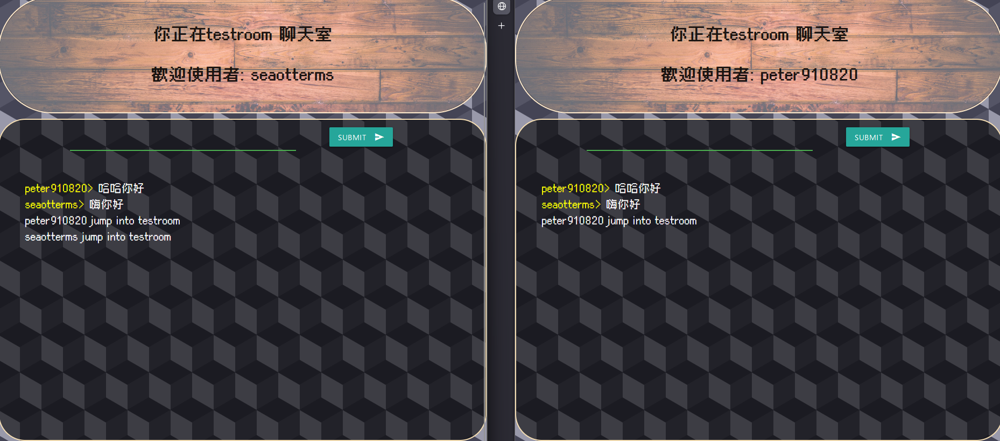

# socketio-chatroom  
a small chatroom made using flask_socketio and socketio

visit -> [https://seaottermsa.com/](https://seaottermsa.com/)

[](https://www.python.org/downloads/release/python-3127/)
[](https://github.com/peter910820/socketio-chatroom/blob/main/LICENSE) 

## ⚙️ Build 

1. clone this repo  
```bash
$ git clone https://github.com/peter910820/socketio-chatroom.git
```  
2. install package  
```bash
$ pip install -r requirements.txt
```  
3. into repo and run server.  
```bash
$ cd ./socketio-chatroom
$ python3 app.py
```  
4. use form to get your github-profile-card  
---  

## 📣 Achievements  

